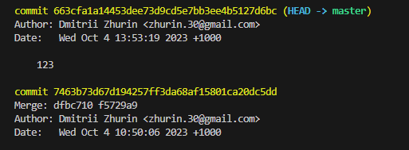
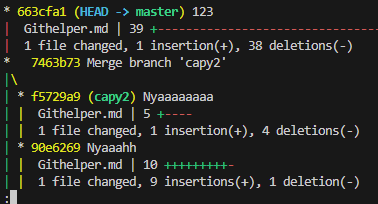
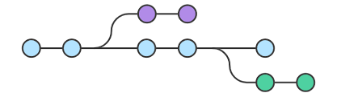

# Шпора по git

Git - это бесплатная распределенная система контроля версий с открытым исходным кодом, предназначенная для быстрой и эффективной работы с любыми проектами.

## Установка и настройка

Для установки git необохдимо вспользоваться ресурсом [git-scm](git-scm.com), где можно загрузить дистрибутив под свою операционную систему.

Проверить установку git можно с помощью команды:

```powershell
git version
```

Чтобы посмотреть все установленные настройки и узнать где именно они заданы, можно использовать команду команду:

```powershell
git config --list --show-origin
```

После установки Git нужно указать имя и адрес электронной почты. Каждый коммит в Git будет содрежать эту информацию. Эта информация не может быть изменена в репозитории.

```powershell
git config --global user.name "John Doe"
```  

```powershell
git config --global user.email johndoe@example.com
```

Если указана опция --global, то эти настройки применяется ко всем будущим репозиториям в системе, иначе только к тому, в котором собираетесь работать.

Так же имеется возможность указать текстовый редактор, который будет использовать git при создании коммитов. По умолчанию это VIM, но с помощью следующей команды можно указать любой другой.

```powershell
git config --global core.editor "'C:/Program Files/Notepad++/notepad++.exe' -multiInst -notabbar -nosession -noPlugin"
```

 Чтобы установить ветку по умолчанию можно использовать команду:

```powershell
git config --global init.defaultBranch main
```

## Инициализация репозитория

Для инициализации репозитория нужно перейти в директорию проекта а затем ввести в терминал команду:

```powershell
git init
```

Проверить инициализацию репозитория можно командой:

```powershell
git status
```

Эта же команда позволяет проверить текущее состояние репозитория.

## Добавление файла для отслеживания

Для того, чтобы git начал следить за изменением файла необходимо внести его в список следующей командой:

```powershell
git add <filename>
```

Так же можно добавить все файлы директории с помощью команды:

```powershell
git add .
```

Однако не все файлы следует добавлять в отслеживание (например dev сборки проекта, png файлы etc.)
Для этого следует создать в директории файл `.gitignore`, в котором указать маски файлов, что следует игнорировать команде `git add .`

## Сохранение изменений

После добавление файла для отслеживания и внесения в него изменений их можно зафиксировать командой:

```powershell
git commit -m "text"
```

Для коммитов желательно указывать комментарии, содержащие пояснения к внесённым изменениям. Ключ m даёт возможность ввести комментарий в этом же месте, если же исользовать `git commit`, то тогда откроется текстовый редактор, в котором уже необходимо ввести комментарий.

## Просмотр коммитов

Для прсомтотра списка коммитов используется команда

```powershell
git log
```



Для данной команды рекомендуется ещё рассотреть применениеи ключей `--oneline` `--graph` `--stat`
Первый ключ выводит инфу в сжатом формате, второй ключ визуализирует всю историю коммитов в виде графа, третий показывает статистику по коммиту: сколько было удалено или добавлено строк.  


## Переход между коммитами

Для перехода между коммитами необходимо использовать команду:

```powershell
git checkout <name>
```

где необходимо указать сокращенное название коммита, которое можно посмотреть командой `git log`

Для возвращение в последний коммит можно также указать название ветки в качестве аргумента.

```powershell
git checkout master
```

## Просмотри отличий коммитов

Для просмотра разницы между коммитами используется следующая команда

```powershell
git diff
```

По умолчанию команда показывает разницу между последний коммитом и несохранёнными изменениями. Однако если указать два идентификатора коммита, то можно посмотреть различия между ними.

```powershell
git diff <commit1> <commit2>
```

## Изменение последнего коммита
Если что-либо забыли изменить в последнем коммите, то нет нужды создавать новый коммит. Все, что нужно это добавить изменение через

```powershell
git add .
```

и:

 ```powershell
git commit --amend
```
Так же можно ввести предыдущую команду с ключом `-m` и указать новый комментарий.

## Создание ветвей

Если имеется необходимости поработать с объектом, сохранив его состояние так, чтобы это не отразилось на основном состоянии, то можно создать отдельную ветку.



Для создание ветки от текущего коммита необходимо ввести команду:

```powershell
git branch <name>
```

## Перемещение по веткам

Для того, чтобы перейти в созданную ветку необходимо ввести команду:

```powershell
git checkout <BranchName>
```

## Слияние веток. Разрешение конфликтов

Для того, чтобы перенести изменение в текущую ветку из другой применяется инструмент `megre`

```powershell
git merge <BranchName>
```

Однако не вегда получается удачно применить этот инструмент -> если в файле редактировали одинаковый участок, то неизбежны конфликты, которые необходимо разрешить вручную (хотя и можно назначить на этой определённые правила).

После `merge` необходимо закоммитить изменения.

## Передача репозитория в облако

### Подключение репозитория

Для подключения внешнего репозитория необходимо ввести команду:

```powershell
git remote add <CloudName> <url>
```

где указать ярлык для локального представления удалённой ветки, а так же url до этой ветки.

### Подгрузка репозитория

Подгрузить репозиторий можно и без подключения к нему командой:

```powershell
git clone <url>
```

### Получение изменений из удалённого репозитория

Чтобы получить изменения из удаленного репозитория в Git предусмотрена команда:

```powershell
git fetch <CloudName>
```

Однако эта команда только подтянет изменения, но не будет делать `merge`.

### Способ с автоматическим `merge`

Для того, чтобы сразу выполнить слияние веток используется команда:

```powershell
git pull <CloudName>
```

По сути, git pull - это то же самое, что `git fetch` + `git merge`.

### Загрузка своих коммитов в облако

Для передачи в удалённый репозиторий своих изменений используется команда:

```powershell
git pull <ClounName> <yourBranchName>
```

Если на удаленной ветке есть коммиты, которые были сделаны позже наших, то есть слияние выполнить неполучится, хотя можно использовать ключ `--force`.  **НО ЭТО ПОТРЁТ ЧУЖИЕ КОММИТЫ**. Вместо этого лучше `git push` использовать, а потом уже `git pull`.

Хотя ещё есть ключ `--force-with-lease`. Он будет делать в точности то же самое, что и `--force`, но если вдруг нужно будет удалить коммит, созданный не мной, выполнение немедленно прекратится и вернется ошибка. Таким образом, я случайно не удалю чужой коммит.

### Авторизация в облачном хранилище репозиториев

Если в системе нет никаких следов подключения к удаленному репозиторию, то может потребоваться автомаризация.

```powershell
git push origin slow-blink (6)
Username for 'https://github.com': yourname
Password for 'https://yourname@github.com': ********
```

Также авторизация может произойти с помощью всплывающего окна браузера, где нужно будет войти в аккант.

Другим способом авторизации служит испоьзование SHH ключей, для чего нужно иметь [сгенерированный](https://git-scm.com/book/en/v2/GitHub-Account-Setup-and-Configuration) SSH ключ.
В настройках удалённого репозитория нужно просто передать свой открытый ключ. В этом случае авторищация будет происходить автоматически.

## Pull Request

Не всегда можно в наглую залить свой код в любую ветку на удалённом репозитории. Часто на главую ветку накладывают ограничение и только некоторый круг лиц коллективным одобрением может позволит запуллить мои изменения в главную ветку. На GitHub для этого используется механизм PullRequest.

Сначала создаётся форк - точная копия чужого репозитория в моём аккаунте, туда я делаю пулл, а потом предлагаю авторам оригинала слить наши ветки в одну.


# TODO Добавить про то как изменить старый коммит.